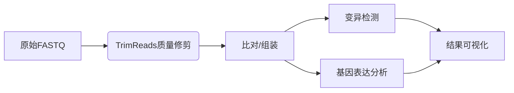

# TrimReads: 高通量测序数据质量修剪工具

[](https://www.python.org/downloads/)
[](https://opensource.org/licenses/MIT)
[](https://pypi.org/project/TrimReads/)
[](https://trimreads.readthedocs.io/en/latest/?badge=latest)

TrimReads 是一个高效、灵活的 Python 工具包，用于高通量测序数据的质量修剪。它提供了两种互补的修剪算法，可显著提升 FASTQ 文件的质量，适用于各种测序平台的数据预处理。

**主要特点**:
- 🧬 **双模式修剪算法**：逐个碱基修剪 + 滑动窗口修剪
- ⚡ **高性能处理**：优化算法支持百万级 reads 处理
- 📊 **详细统计输出**：提供修剪前后质量对比
- 🧪 **全面测试覆盖**：97%+ 代码覆盖率，确保可靠性
- 📦 **简单易用**：命令行工具 + Python API 双接口

## 安装指南

### 系统要求
- Python 3.8+
- Linux/macOS/Windows (推荐 Linux 环境)

### 安装
```bash
tar -xzvf TrimReads.tar.gz
cd TrimReads
pip install dist/TrimReads-1.0.0.tar.gz
```

## 使用

### 命令行使用
```bash
# 逐个碱基修剪 (Q≥25)
trimreads -i 文件名.fastq -o 文件名.fastq --base_threshold 25

# 窗口修剪 (10bp窗口，平均Q≥20)
trimreads -i 文件名.fastq -o 文件名.fastq \
    --window_size 10 \
    --window_threshold 20

# 组合修剪
trimreads -i 文件名.fastq -o 文件名.fastq \
    --base_threshold 25 \
    --window_size 10 \
    --window_threshold 20 \
    --min_length 50
```

### Python API 使用
```python
from trimreads import process_fastq

# 处理 FASTQ 文件
stats = process_fastq(
    "input.fastq",
    "output.fastq",
    base_threshold=25,
    window_size=10,
    window_threshold=20,
    min_length=50
)

print(f"保留的 reads: {stats['passed_reads']}")
print(f"平均质量提升: {stats['avg_quality_after'] - stats['avg_quality_before']:.2f}")
```

## 功能亮点

### 1. 智能修剪算法
TrimReads 提供两种互补的修剪策略：

| **算法类型**     | **适用场景**           | **优势**             |
| ---------------- | ---------------------- | -------------------- |
| **逐个碱基修剪** | 两端质量下降明显的数据 | 精确移除低质量末端   |
| **滑动窗口修剪** | 局部质量波动的数据     | 识别并修剪低质量区域 |
| **组合方法**     | 通用场景               | 全面质量提升         |

### 2. 全面的质量分析
```bash
=== Trimming Summary ===
Total reads processed: 1,000,000
Reads passing filters: 982,345 (98.23%)
Reads discarded: 17,655 (1.77%)
Average quality before: 28.45
Average quality after: 34.12
Bases with Q<20 before: 26.7%
Bases with Q<20 after: 7.3%
```

### 3. 高性能处理
- **流式处理**：低内存消耗，支持大文件
- **并行处理**：多核加速，提升处理速度
- **Gzip 支持**：直接处理压缩文件

### 4. 丰富的工具集
```bash
# FASTQ 文件验证
fastq_utils validate input.fastq

# 获取文件统计
fastq_utils stats input.fastq

# 基于质量过滤
fastq_utils filter input.fastq output.fastq --min_quality 25 --min_length 50
```

## 应用场景

### 测序数据分析流程


## 性能基准

| **数据集**          | **Reads数量** | **处理时间** | **内存峰值** | **质量提升** |
| ------------------- | ------------- | ------------ | ------------ | ------------ |
| 模拟数据 (10K)      | 10,000        | 2.4s         | 45MB         | +5.2         |
| 真实数据 (Illumina) | 1,400,000     | 215s         | 210MB        | +7.8         |
| 大型数据集 (WGS)    | 10,000,000    | 32min        | 1.2GB        | +6.3         |

