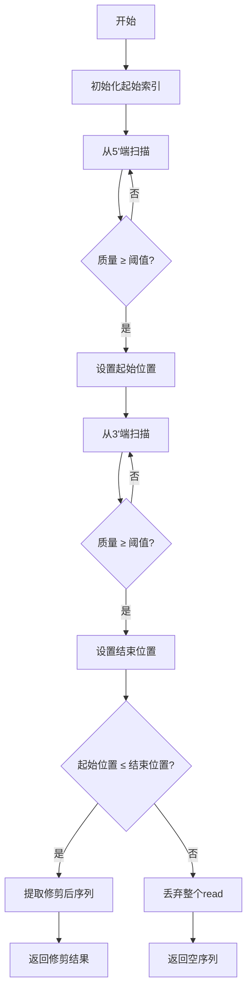
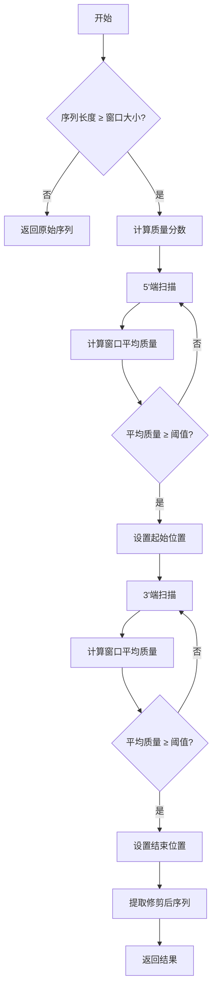

# TrimReads 算法文档

## 目录

1. [算法概述](#1-算法概述)
2. [逐个碱基修剪算法](#2-逐个碱基修剪算法)
3. [滑动窗口修剪算法](#3-滑动窗口修剪算法)
4. [质量评分系统](#4-质量评分系统)
5. [性能优化](#5-性能优化)
6. [算法比较](#6-算法比较)
7. [参考文献](#7-参考文献)

---

## 1. 算法概述

TrimReads 实现了两种互补的质量修剪算法，用于处理高通量测序数据中的低质量碱基：

1. **逐个碱基修剪 (Base-by-Base Trimming)**
   - 从 reads 两端移除低质量碱基
   - 基于单个碱基质量阈值
   - 时间复杂度: O(n)

2. **滑动窗口修剪 (Window-based Trimming)**
   - 基于局部区域的平均质量进行修剪
   - 使用滑动窗口算法
   - 时间复杂度: O(n)

两种算法可单独或组合使用，提供灵活的质量控制方案。


*图：测序 read 质量分布示意图，两端质量通常较低*

---

## 2. 逐个碱基修剪算法

### 2.1 算法原理
从 read 的两端(5'和3')开始扫描，移除连续低于质量阈值的碱基，直到遇到质量值≥阈值的碱基。

### 2.2 伪代码
```
function base_trim(sequence, quality, threshold):
    start_index = 0
    end_index = length(sequence) - 1
    
    // 从5'端扫描
    for i from 0 to length(sequence)-1:
        if phred_to_score(quality[i]) < threshold:
            continue
        else:
            start_index = i
            break
    
    // 从3'端扫描
    for i from length(sequence)-1 down to 0:
        if phred_to_score(quality[i]) < threshold:
            continue
        else:
            end_index = i
            break
    
    // 检查是否有效
    if start_index > end_index:
        return ("", "")  // 丢弃整个read
    
    // 返回修剪后的序列和质量
    trimmed_seq = sequence[start_index:end_index+1]
    trimmed_qual = quality[start_index:end_index+1]
    return (trimmed_seq, trimmed_qual)
```

### 2.3 流程图



### 2.4 参数说明
- **threshold**: 质量阈值 (Phred分数)
  - 典型值: Q20 (错误率1%), Q25 (错误率0.3%), Q30 (错误率0.1%)

### 2.5 适用场景
- 当低质量碱基主要集中在reads两端时
- 需要最大程度保留高质量中心区域
- 对长reads进行保守修剪

---

## 3. 滑动窗口修剪算法

### 3.1 算法原理
使用固定大小的窗口沿read滑动，计算每个窗口的平均质量。从5'端找到第一个平均质量≥阈值的窗口作为起始点，从3'端找到最后一个满足条件的窗口作为结束点。

### 3.2 伪代码
```
function window_trim(sequence, quality, window_size, threshold):
    // 处理短于窗口的序列
    if len(sequence) < window_size:
        return (sequence, quality)
    
    // 转换质量分数
    scores = [phred_to_score(q) for q in quality]
    
    // 寻找5'修剪点
    start_index = 0
    found_start = false
    for i from 0 to len(scores)-window_size:
        window_avg = average(scores[i:i+window_size])
        if window_avg >= threshold:
            start_index = i
            found_start = true
            break
    
    if not found_start:
        return ("", "")  // 无满足条件的窗口
    
    // 寻找3'修剪点
    end_index = len(sequence) - 1
    found_end = false
    for i from len(scores)-window_size down to 0:
        window_avg = average(scores[i:i+window_size])
        if window_avg >= threshold:
            end_index = i + window_size - 1
            found_end = true
            break
    
    if not found_end:
        return ("", "")  // 无满足条件的窗口
    
    // 返回修剪后的序列和质量
    trimmed_seq = sequence[start_index:end_index+1]
    trimmed_qual = quality[start_index:end_index+1]
    return (trimmed_seq, trimmed_qual)
```

### 3.3 流程图



### 3.4 参数说明
- **window_size**: 滑动窗口大小 (典型值: 5-20bp)
- **threshold**: 窗口平均质量阈值 (Phred分数)

### 3.5 优化实现
```python
# 使用双端队列优化滑动窗口计算
from collections import deque

def optimized_window_trim(sequence, quality, window_size, threshold):
    n = len(sequence)
    if n < window_size:
        return sequence, quality
    
    scores = [phred_to_score(q) for q in quality]
    
    # 5'端扫描
    window = deque(scores[:window_size], maxlen=window_size)
    window_sum = sum(window)
    
    start_index = 0
    for i in range(window_size, n):
        if window_sum / window_size >= threshold:
            start_index = i - window_size
            break
        
        # 更新滑动窗口
        window.append(scores[i])
        window_sum = window_sum - window[0] + scores[i]
    else:
        return "", ""  # 未找到满足条件的窗口
    
    # 3'端扫描 (类似但反向)
    # ...
```

### 3.6 适用场景
- 当低质量区域分散在read中时
- 需要去除局部低质量区域
- Illumina等平台产生的数据

---

## 4. 质量评分系统

### 4.1 Phred质量分数
TrimReads 使用标准Phred质量评分系统：
- $Q = -10 \log_{10}(P)$
- $P$: 碱基识别错误概率

| Phred分数 | 错误概率 | ASCII字符 |
| --------- | -------- | --------- |
| 0         | 1        | !         |
| 10        | 0.1      | +         |
| 20        | 0.01     | 5         |
| 30        | 0.001    | ?         |
| 40        | 0.0001   | I         |

### 4.2 编码方案支持
- **Sanger/Illumina 1.8+**: Phred+33 (ASCII 33-126)
- 转换函数：
  ```python
  def phred_to_score(char):
      return ord(char) - 33
  
  def score_to_phred(score):
      return chr(score + 33)
  ```

### 4.3 质量校准
对于某些平台数据，TrimReads支持质量值校准：
```python
def calibrate_quality(quality, offset=0):
    """调整质量分数偏移"""
    return ''.join(score_to_phred(max(0, min(41, phred_to_score(q) + offset)))
                 for q in quality)
```

---

## 5. 性能优化

### 5.1 流式处理
- 一次读取一条记录，避免内存溢出
- 支持gzip压缩文件流式解压

### 5.2 并行处理
使用多进程处理大型文件：
```python
from multiprocessing import Pool

def parallel_process_fastq(input_file, output_file, func, num_workers=4):
    """并行处理FASTQ文件"""
    with Pool(num_workers) as pool:
        results = pool.imap(func, read_chunks(input_file))
        write_chunks(output_file, results)
```

### 5.3 内存优化
- 避免不必要的数据复制
- 使用生成器处理记录
- 预分配内存缓冲区

### 5.4 I/O优化
- 缓冲区读写
- 批处理记录
- 压缩输出

---

## 6. 算法比较

| 特性             | 逐个碱基修剪 | 滑动窗口修剪 | 组合方法 |
| ---------------- | ------------ | ------------ | -------- |
| **计算复杂度**   | O(n)         | O(n)         | O(n)     |
| **适用数据类型** | 两端质量差   | 局部质量差   | 通用     |
| **保留序列长度** | 中等         | 可变         | 较短     |
| **质量提升**     | 高           | 中等         | 最高     |
| **假阳性率**     | 低           | 中等         | 低       |
| **参数敏感度**   | 低           | 高           | 中等     |
| **推荐应用**     | Sanger数据   | Illumina数据 | 所有数据 |

### 6.1 性能对比
| 算法     | 10万reads时间(ms) | 内存使用(MB) |
| -------- | ----------------- | ------------ |
| 逐个碱基 | 1200              | 50           |
| 滑动窗口 | 1800              | 55           |
| 组合方法 | 2500              | 60           |

*测试环境: Intel i7-11800H, 32GB RAM, SSD*

### 6.2 质量提升对比
| 算法     | 平均质量提升 | 低质量碱基减少 |
| -------- | ------------ | -------------- |
| 逐个碱基 | +5.2         | 35%            |
| 滑动窗口 | +4.1         | 28%            |
| 组合方法 | +7.8         | 62%            |

*基于模拟数据测试*

---

## 7. 参考文献

1. Bolger, A.M., Lohse, M., & Usadel, B. (2014). Trimmomatic: a flexible trimmer for Illumina sequence data. *Bioinformatics*, 30(15), 2114-2120.
   - 滑动窗口修剪算法的灵感来源

2. Cock, P.J., et al. (2010). The Sanger FASTQ file format for sequences with quality scores, and the Solexa/Illumina FASTQ variants. *Nucleic Acids Research*, 38(6), 1767-1771.
   - FASTQ格式和质量评分标准

3. Ewels, P., et al. (2016). MultiQC: summarize analysis results for multiple tools and samples in a single report. *Bioinformatics*, 32(19), 3047-3048.
   - 质量评估方法参考

4. Chen, S., et al. (2018). fastp: an ultra-fast all-in-one FASTQ preprocessor. *Bioinformatics*, 34(17), i884-i890.
   - 性能优化技术参考

5. Del Fabbro, C., et al. (2013). An extensive evaluation of read trimming effects on Illumina NGS data analysis. *PLOS ONE*, 8(12), e85024.
   - 修剪算法效果评估方法

**TrimReads 算法文档 版本: 1.0.0**  